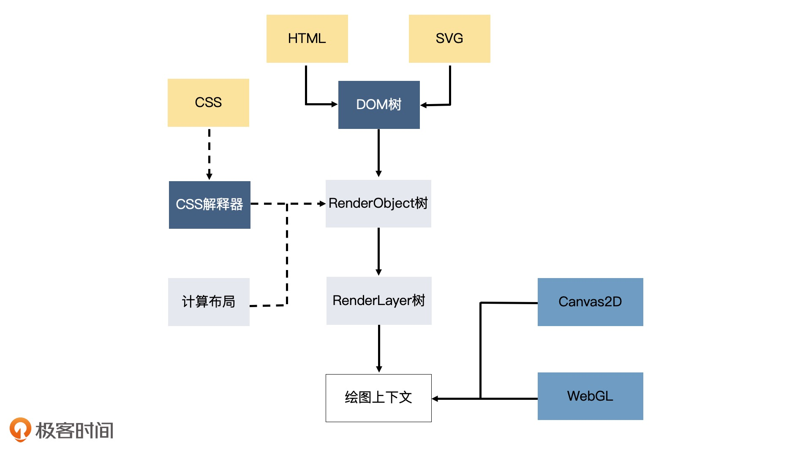
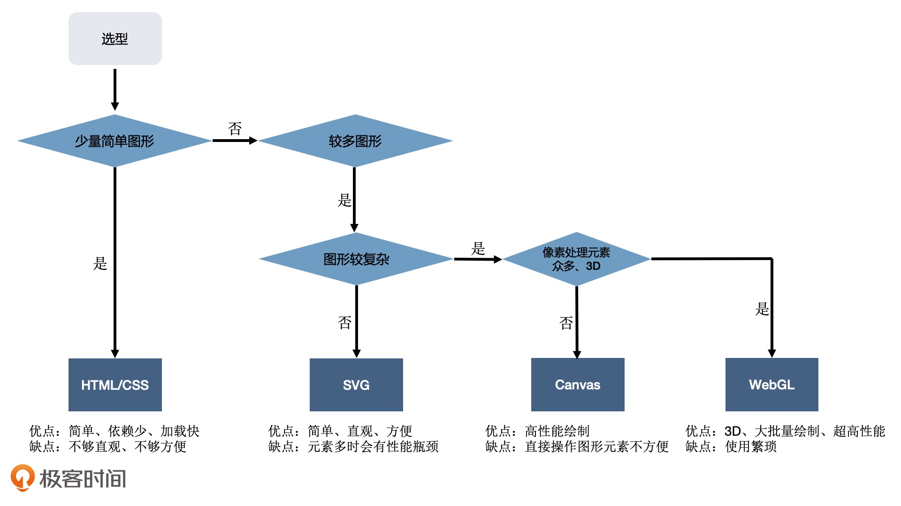

# 可视化

浏览器 DOM、Canvas、WebGL 渲染

浏览器绘制 HTML+CSS 流程：  
1.处理 HTML，构建 DOM 树。  
2.处理 CSS，构建 CSSOM 树。  
3.合并成渲染树。  
4.根据渲染树布局（重排）。  
5.绘制（重绘）。

## 可视化渲染方式

### HTML + CSS

方便，不用其它依赖，可以绘制少量常见的图标，一旦图形复杂起来，就会造成性能的损耗。

### SVG

对 HTML+ CSS 的加强,弥补了 HTML+CSS 绘制不规则图形上的不足，但图形复杂起来，也会造成性能的损耗。

### Canvas2D

有浏览器提供的一套 api，能够很方便的绘制出复杂的图形。跳过了 HTML+CSS 的构建过程，直接绘制。性能更好，但处理大量像素计算时，还是会存在瓶颈。

### WebGL

是浏览器提供的绘图系统，复杂、强大，能充分利用 GPU 的并行计算能力。

